# 🚀 KisaanCenter GitHub Actions Workflows

This repository includes comprehensive GitHub Actions workflows for CI/CD, testing, and deployment. The workflows are specifically designed for the KisaanCenter application with TypeScript backend and React frontend.

## 📋 Available Workflows

### 1. 🔄 **Continuous Integration** (`.github/workflows/ci.yml`)

**Triggers:**
- 🔀 Pull requests to `main`/`develop` branches
- 🔀 Push to `main`/`develop` branches
- ❌ Excludes documentation changes (*.md files)

**Jobs:**
- **Backend Validation** 🔍
  - TypeScript compilation check
  - ESLint code linting  
  - Unit and integration tests
  - Security dependency audit
  - Test coverage upload
  
- **Frontend Validation** 🔍
  - TypeScript compilation check
  - ESLint code linting
  - Security dependency audit
  - Build artifact generation

- **Security Scan** 🔒 (main branch only)
  - Trivy vulnerability scanning
  - SARIF upload to GitHub Security

### 2. � **Backend Deployment** (`.github/workflows/deploy-backend.yml`)

**Triggers:**
- Push to `main` branch with backend changes
- Manual workflow dispatch

**Jobs:**
- **Validate** 🔍 (prerequisite)
  - TypeScript build validation
  - Code linting and testing
  - Security audit

- **Deploy** 🐳 (after validation)
  - Docker image build with GitHub Actions cache
  - Push to GitHub Container Registry (ghcr.io)
  - Deploy to Azure Container Apps
  - Health check verification

**Features:**
- Multi-layer Docker caching for faster builds
- Zero-downtime deployment
- Automated health checks
- Comprehensive deployment summary

### 3. 🌐 **Frontend Deployment** (`.github/workflows/deploy-frontend.yml`)

**Triggers:**
- Push to `main` branch with frontend changes
- Manual workflow dispatch

**Jobs:**
- **Validate** 🔍 (prerequisite)
  - TypeScript build validation
  - Code linting
  - Security audit

- **Build** 🏗️ (after validation)
  - Production build with Vite
  - Environment configuration
  - Static asset optimization

- **Deploy** 📤
  - GitHub Pages deployment
  - Custom domain configuration

## � Key Improvements Made

Based on the recent TypeScript fixes, the workflows now include:

### Enhanced TypeScript Validation
- **Early Error Detection:** TypeScript compilation runs before deployment
- **Type Safety:** Prevents runtime errors from type mismatches
- **Build Consistency:** Ensures the same build process locally and in CI

### Comprehensive Testing Strategy
- **Unit Tests:** Core business logic validation
- **Integration Tests:** Database and API integration testing
- **Test Artifacts:** Coverage reports and test results preserved
- **Non-blocking Tests:** Tests run with continue-on-error for optional scenarios

### Advanced Security Measures
- **Dependency Auditing:** npm audit with high-severity threshold
- **Container Scanning:** Trivy security scanner for Docker images
- **SARIF Integration:** Security findings integrated with GitHub Security tab
- **Regular Monitoring:** Scheduled security scans

### Performance Optimizations
- **Docker Layer Caching:** GitHub Actions cache for faster builds
- **npm Dependency Caching:** Cached node_modules across runs
- **Build Artifact Reuse:** Frontend builds cached between jobs
- **Parallel Execution:** Frontend and backend validation run concurrently

## �️ Required Configuration

### GitHub Secrets

For Azure deployment:
```
AZURE_CLIENT_ID          # Azure Service Principal ID
AZURE_CLIENT_SECRET      # Azure Service Principal Secret
AZURE_SUBSCRIPTION_ID    # Azure Subscription ID
AZURE_TENANT_ID          # Azure Tenant ID
AZURE_CONTAINER_APP_NAME # Container App name
AZURE_RESOURCE_GROUP     # Resource Group name
```

For database configuration:
```
DB_HOST                  # Database host
DB_PORT                  # Database port
DB_NAME                  # Database name
DB_USER                  # Database user
DB_PASSWORD              # Database password
```

### Package.json Scripts

Ensure these scripts exist in your package.json:

**Backend** (`kisaan-backend-node/package.json`):
```json
{
  "scripts": {
    "build": "tsc",
    "lint": "eslint src/**/*.ts",
    "test": "jest",
    "test:integration": "jest --config jest.integration.config.js"
  }
}
```

**Frontend** (`kisaan-frontend/package.json`):
```json
{
  "scripts": {
    "build": "tsc && vite build",
    "lint": "eslint . --ext ts,tsx"
  }
}
```

## 🚀 Deployment Architecture

```mermaid
graph TD
    A[Developer Push] --> B[CI Validation]
    B --> C{TypeScript Build OK?}
    C -->|❌ No| D[Block Deployment]
    C -->|✅ Yes| E[Security Scan]
    E --> F[Deploy Backend]
    E --> G[Deploy Frontend]
    F --> H[Azure Container Apps]
    G --> I[GitHub Pages]
    H --> J[Health Check]
    I --> K[Custom Domain]
```



## � Workflow Status Monitoring

### Success Indicators
- ✅ All TypeScript compilation passes
- ✅ No high-severity security vulnerabilities
- ✅ Deployment health checks pass
- ✅ Build artifacts generated successfully

### Failure Scenarios
- ❌ TypeScript compilation errors
- ❌ ESLint violations (blocking)
- ❌ Docker build failures
- ❌ Azure deployment issues
- ❌ Health check failures

## � Troubleshooting Guide

### Common Build Issues

**TypeScript Compilation Errors:**
```bash
# Local debugging
cd kisaan-backend-node
npm run build
# Fix type errors before pushing
```

**Docker Build Failures:**
```bash
# Test Docker build locally
cd kisaan-backend-node
docker build -t test-build .
```

**Azure Deployment Issues:**
- Verify secrets are configured correctly
- Check Azure Container Apps logs
- Ensure database connection strings are valid

### Security Alert Resolution

1. **High-Severity npm Vulnerabilities:**
   ```bash
   npm audit fix
   # Review and test changes
   ```

2. **Container Security Issues:**
   - Update base Docker images
   - Review Trivy scan results
   - Apply security patches

## 🎯 Best Practices

### Development Workflow
1. **Local Testing:** Always run `npm run build` and `npm run lint` locally
2. **Branch Strategy:** Use feature branches and pull requests
3. **Commit Messages:** Follow conventional commit format
4. **Type Safety:** Address TypeScript errors immediately

### Deployment Strategy
1. **Gradual Rollout:** Test in development environment first
2. **Monitor Health:** Check deployment health endpoints
3. **Rollback Plan:** Keep previous versions available
4. **Database Migrations:** Handle schema changes carefully

### Security Practices
1. **Regular Updates:** Keep dependencies current
2. **Secret Management:** Use GitHub Secrets for sensitive data
3. **Access Control:** Limit deployment permissions
4. **Audit Logs:** Monitor deployment activities

## 📚 Additional Resources

- [TypeScript Configuration Guide](../docs/typescript-setup.md)
- [Azure Container Apps Documentation](https://docs.microsoft.com/en-us/azure/container-apps/)
- [GitHub Actions Best Practices](https://docs.github.com/en/actions/learn-github-actions/security-hardening-for-github-actions)
- [Docker Security Best Practices](https://docs.docker.com/engine/security/)

---

🎯 **Ready to deploy?** Push your changes to `main` branch and watch the automated workflows handle the rest!
