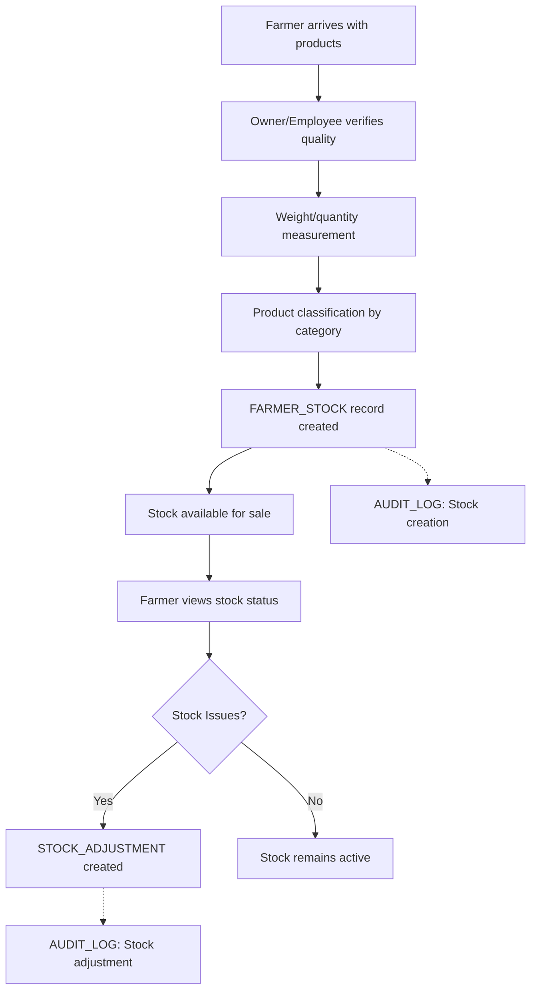
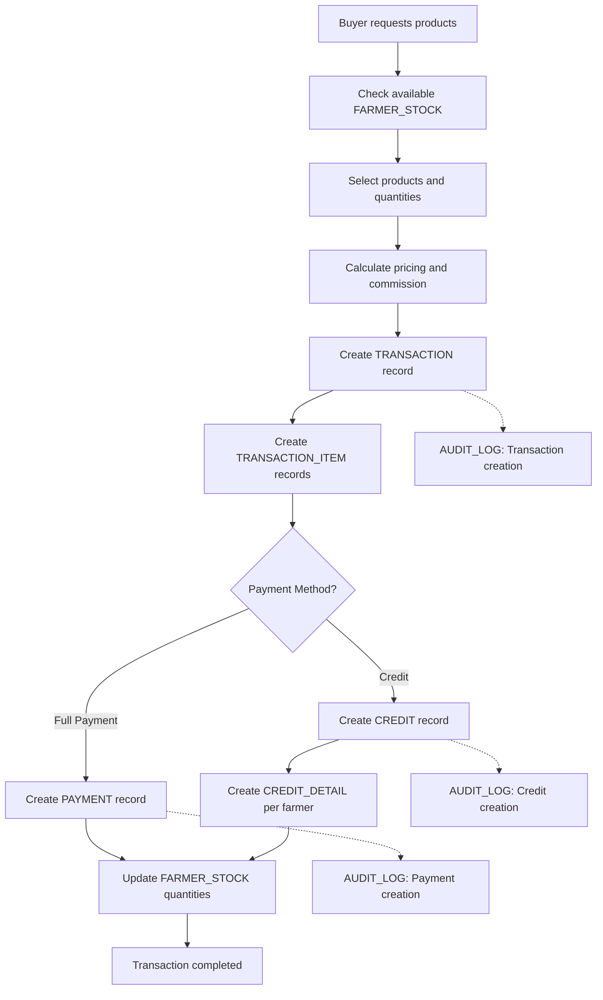
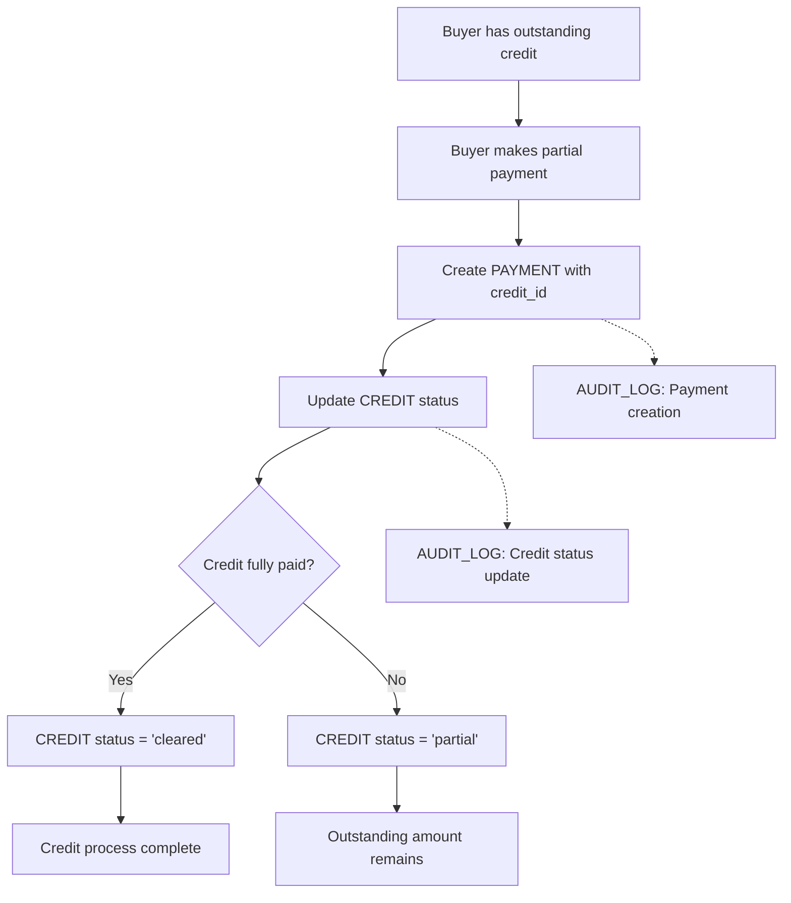
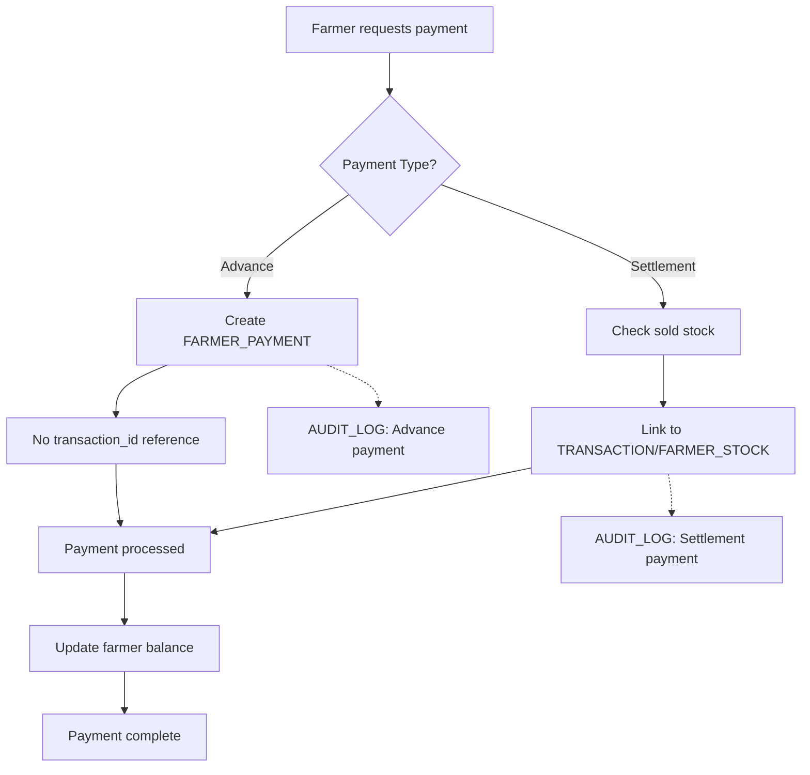

# Market Management System - Business Workflows

## 🔄 **Complete Business Process Documentation**

This document contains all business workflows, use cases, and operational processes for the Market Management System.

---

## Core Business Workflows

### 1. Farmer Stock Delivery Process



### 2. Sales Transaction Process



### 3. Credit Management Process



### 4. Farmer Payment Process



---

## Business Use Cases by User Role

### OWNER Use Cases

#### Daily Operations Management
1. **Stock Overview**
   ```
   - View all farmer deliveries for the day
   - Check available stock by product and farmer
   - Monitor stock aging and quality issues
   - Handle stock adjustments and corrections
   ```

2. **Sales Monitoring**
   ```
   - Track daily sales volume and revenue
   - Monitor buyer credit utilization
   - Review commission earnings per transaction
   - Analyze product performance and pricing
   ```

3. **Financial Management**
   ```
   - Review pending farmer payments
   - Manage buyer credit limits and outstanding amounts
   - Track expenses across categories
   - Generate financial reports for analysis
   ```

#### Example Owner Daily Workflow:
```
Morning:
- Review overnight deliveries → Check FARMER_STOCK entries
- Set pricing based on market conditions → Update reference prices
- Review pending payments → Check FARMER_PAYMENT and CREDIT tables

Afternoon:
- Monitor sales transactions → Track TRANSACTION volume
- Handle customer inquiries → Check buyer ledgers
- Process farmer payments → Create FARMER_PAYMENT records

Evening:
- Generate daily reports → Query aggregated transaction data
- Update stock status → Modify FARMER_STOCK as needed
- Plan next day operations → Review pending items
```

### FARMER Use Cases

#### Stock Management
1. **Delivery Tracking**
   ```
   - View delivered stock status and quantities
   - Check sales progress for delivered products
   - Monitor pricing and commission rates
   - Request stock adjustments if needed
   ```

2. **Payment Management**
   ```
   - View payment history and outstanding amounts
   - Request advance payments
   - Track settlement payments for sold stock
   - View detailed payment breakdowns
   ```

#### Example Farmer Daily Workflow:
```
Morning:
- Check yesterday's sales → Query TRANSACTION_ITEM for farmer's products
- Review stock status → Check FARMER_STOCK quantities and status

Afternoon:
- Request payment for sold stock → Initiate FARMER_PAYMENT settlement
- Plan next delivery based on demand → Analyze transaction patterns

Evening:
- Review payment status → Check FARMER_PAYMENT records
- Plan product mix for next delivery → Based on sales data
```

### BUYER Use Cases

#### Purchase Management
1. **Product Selection**
   ```
   - Browse available products by category
   - Check product quality and pricing
   - View farmer-specific product details
   - Make bulk purchase selections
   ```

2. **Credit Management**
   ```
   - View credit limit and utilization
   - Check outstanding amounts per farmer
   - Make partial payments on credit
   - Track payment history
   ```

#### Example Buyer Daily Workflow:
```
Morning:
- Check available products → Query active FARMER_STOCK
- Review credit status → Check CREDIT outstanding amounts
- Plan purchase requirements → Based on business needs

Afternoon:
- Make purchases → Create TRANSACTION records
- Choose payment method → Create PAYMENT or CREDIT
- Update purchase records → Review TRANSACTION_ITEM details

Evening:
- Review daily purchases → Check transaction summary
- Plan credit payments → Review CREDIT_DETAIL breakdown
```

### EMPLOYEE Use Cases

#### Operational Support
1. **Transaction Processing**
   ```
   - Help customers with product selection
   - Process sales transactions and payments
   - Handle returns and exchanges
   - Manage guest buyer registrations
   ```

2. **Stock Management**
   ```
   - Assist with farmer deliveries
   - Handle stock adjustments and corrections
   - Update product information
   - Manage inventory levels
   ```

---

## Complex Business Scenarios

### Scenario 1: Multi-Farmer Credit Transaction
```
Business Case: Buyer purchases products from 3 different farmers on credit

Process Flow:
1. Create single TRANSACTION record
2. Create multiple TRANSACTION_ITEM records (one per farmer)
3. Create single CREDIT record for total amount
4. Create CREDIT_DETAIL records for each farmer breakdown
5. Update FARMER_STOCK quantities

Database Impact:
- 1 TRANSACTION record
- 3 TRANSACTION_ITEM records
- 1 CREDIT record
- 3 CREDIT_DETAIL records
- 3 FARMER_STOCK updates
- Multiple AUDIT_LOG entries
```

### Scenario 2: Partial Payment on Mixed Credit
```
Business Case: Buyer pays 2000 on total credit of 5000 across 3 farmers

Process Flow:
1. Create PAYMENT record with credit_id reference
2. Calculate proportional payment distribution
3. Update CREDIT status to 'partial'
4. Maintain CREDIT_DETAIL farmer breakdowns

Calculation Logic:
- Farmer A credit: 1500 → Payment allocated: 600
- Farmer B credit: 2000 → Payment allocated: 800  
- Farmer C credit: 1500 → Payment allocated: 600
- Remaining credit: 3000
```

### Scenario 3: Guest Buyer Registration
```
Business Case: Walk-in customer makes purchases, then decides to register

Initial Process:
1. Create GUEST user with format: GUEST_SHOP1_20240125_143022
2. Process transaction with guest buyer_user_id
3. Create credit/payment records as normal

Registration Process:
1. Create new USER with buyer role
2. No data migration from guest records
3. Guest records remain for audit purposes
4. New purchases use registered user ID
```

### Scenario 4: Product Return Processing
```
Business Case: Buyer returns products due to quality issues

Process Flow:
1. Create new TRANSACTION with type='return'
2. Set parent_transaction_id to original transaction
3. Create negative TRANSACTION_ITEM quantities
4. Update FARMER_STOCK quantities (return to stock)
5. Process refund payment or credit adjustment
6. Create comprehensive audit trail

Database Impact:
- Return TRANSACTION record
- Negative TRANSACTION_ITEM records
- FARMER_STOCK quantity increases
- PAYMENT refund or CREDIT adjustment
- Complete AUDIT_LOG trail
```

---

## Performance Optimization Workflows

### Daily Maintenance Tasks
```sql
-- Update materialized views for reporting
REFRESH MATERIALIZED VIEW mv_current_stock;
REFRESH MATERIALIZED VIEW mv_daily_sales_summary;

-- Clean up old sessions and temporary data
DELETE FROM user_sessions WHERE expires_at < NOW();

-- Archive old audit logs (older than 6 months)
INSERT INTO audit_log_archive 
SELECT * FROM audit_log 
WHERE created_at < NOW() - INTERVAL '6 months';
```

### Weekly Aggregation Tasks
```sql
-- Generate weekly stock movement reports
INSERT INTO stock_movement_summary (
    week_start, shop_id, product_id, 
    total_delivered, total_sold, total_adjusted
)
SELECT 
    DATE_TRUNC('week', fs.date) as week_start,
    fs.shop_id,
    fs.product_id,
    SUM(fs.quantity) as total_delivered,
    COALESCE(sales.total_sold, 0) as total_sold,
    COALESCE(adj.total_adjusted, 0) as total_adjusted
FROM farmer_stock fs
LEFT JOIN (sales subquery) ON ...
LEFT JOIN (adjustments subquery) ON ...
WHERE fs.date >= NOW() - INTERVAL '1 week'
GROUP BY DATE_TRUNC('week', fs.date), fs.shop_id, fs.product_id;
```

---

## Error Handling Workflows

### Transaction Rollback Process
```sql
BEGIN;
    -- Create transaction
    INSERT INTO TRANSACTION (...) VALUES (...);
    
    -- Create transaction items
    INSERT INTO TRANSACTION_ITEM (...) VALUES (...);
    
    -- Update stock quantities
    UPDATE FARMER_STOCK SET quantity = quantity - ? WHERE id = ?;
    
    -- Verify stock not negative
    IF (SELECT quantity FROM FARMER_STOCK WHERE id = ?) < 0 THEN
        ROLLBACK;
        RAISE EXCEPTION 'Insufficient stock available';
    END IF;
    
    -- Create payment/credit records
    INSERT INTO PAYMENT/CREDIT (...) VALUES (...);
    
COMMIT;
```

### Data Integrity Checks
```sql
-- Daily integrity check queries
SELECT 'CREDIT_DETAIL_MISMATCH' as issue,
       COUNT(*) as count
FROM credit c
JOIN (
    SELECT credit_id, SUM(quantity * price) as detail_total
    FROM credit_detail
    GROUP BY credit_id
) cd ON c.id = cd.credit_id
WHERE ABS(c.amount - cd.detail_total) > 0.01;

-- Stock quantity validation
SELECT 'NEGATIVE_STOCK' as issue,
       COUNT(*) as count
FROM farmer_stock
WHERE status = 'active' AND quantity < 0;
```

This comprehensive workflow documentation ensures all business processes are clearly defined and can be properly implemented in the system.
