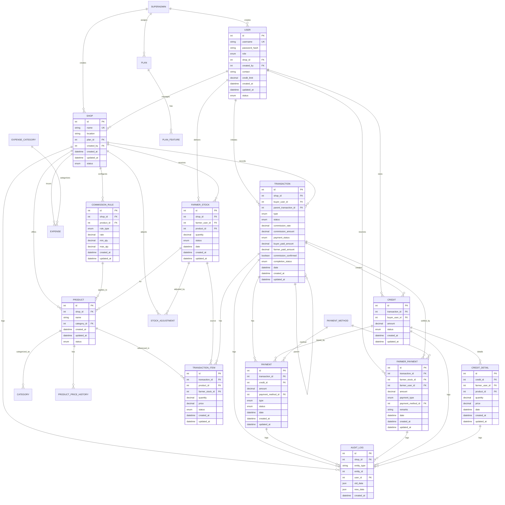
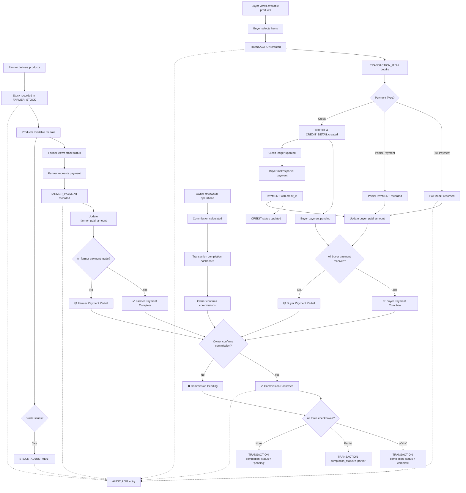

# Market Management System - Entity Relationship Diagram

## 🎯 **ERD Overview**
This document contains the core Entity Relationship Diagram for the Market Management System, showing the relationships between all entities and their key attributes.

**📋 Related Documentation:**
- [Database Schema](./Database_Schema.md) - Complete SQL table definitions
- [Business Rules](./Business_Rules.md) - Business logic and validation rules  
- [System Architecture](./System_Architecture.md) - Technology stack and architecture
- [API Specification](./API_Specification.md) - REST API endpoints

---

## Entity Relationship Diagram



---

## System Workflow Overview

### Complete Business Process Flow with Transaction Completion Tracking


---

## Core Entity Relationships Explained

### 1. **User Management Hierarchy**
- **SUPERADMIN** creates and manages **SHOP** entities
- **USER** entities have roles (owner, farmer, buyer, employee, guest)
- Each **USER** is associated with a **SHOP** (except guests)

### 2. **Stock Management Flow**
- **FARMER_STOCK** tracks farmer deliveries per product
- **TRANSACTION_ITEM** references specific **FARMER_STOCK** entries
- **STOCK_ADJUSTMENT** handles corrections and modifications

### 3. **Transaction & Payment Architecture with Completion Tracking**
- **TRANSACTION** can have multiple **TRANSACTION_ITEM** entries
- **PAYMENT** can be linked to **TRANSACTION** (direct) or **CREDIT** (repayment)
- **FARMER_PAYMENT** handles farmer settlements and advances
- **Transaction Completion Model**: Three-checkpoint system
  - `buyer_paid_amount`: Tracks total payments received from buyer
  - `farmer_paid_amount`: Tracks total payments made to farmers
  - `commission_confirmed`: Boolean flag for owner commission confirmation
  - `completion_status`: Overall transaction status ('pending', 'partial', 'complete')
- **Completion Logic**: Transaction marked complete only when all three checkboxes are ticked:
  - ✅ Buyer payment complete (buyer_paid_amount >= transaction total)
  - ✅ Farmer payment complete (farmer_paid_amount >= settlement amount)
  - ✅ Commission confirmed by owner (commission_confirmed = TRUE)

### 4. **Credit Management System**
- **CREDIT** tracks buyer's total outstanding amount
- **CREDIT_DETAIL** breaks down credit per farmer and product
- Multiple **PAYMENT** entries can settle one **CREDIT**

### 5. **Audit & Compliance**
- **AUDIT_LOG** captures all critical data changes
- JSON fields store old and new data states
- Complete traceability for regulatory compliance

---

## Key Business Rules Reflected in ERD

### 1. **Multi-Tenant Design**
- All core entities linked to **SHOP** for data isolation
- **SUPERADMIN** has cross-shop access capabilities

### 2. **Flexible Payment Models with Completion Tracking**
- Support for full payments, partial payments, and credit
- Advance payments to farmers before stock delivery
- Commission tracking per transaction
- **Three-Party Completion Model**: Independent tracking of buyer payments, farmer payments, and commission confirmation
- **Partial Payment Support**: Proportional calculation of commission based on actual payments received
- **Owner Control**: Manual commission confirmation prevents premature transaction completion
- **Status Progression**: 'pending' → 'partial' → 'complete' based on all three checkboxes

### 3. **Stock Lifecycle Management**
- Stock status progression: active → closed/returned/discarded
- Adjustment capabilities for corrections
- Historical tracking of all stock movements

### 4. **Credit Management**
- Per-buyer credit limits with real-time validation
- Detailed breakdown of credit per farmer
- Flexible repayment with partial payment support

### 5. **Transaction Completion Control**
- **Three-Checkpoint System**: Ensures no transaction is considered complete until all parties are properly handled
- **Independent Payment Tracking**: Buyer payments, farmer payments, and commission confirmation tracked separately
- **Partial Payment Flexibility**: Support for any combination of partial payments with proportional commission calculation
- **Owner Verification**: Manual commission confirmation prevents automatic assumptions about transaction completion
- **Status Transparency**: Clear visibility of what payments are pending and what actions are required

---

## Transaction Completion Workflow

### Three-Checkbox Completion Model

Every transaction requires three independent confirmations:

1. **✅ Buyer Payment Checkbox**
   - Tracks: `buyer_paid_amount` vs transaction total
   - Status: Complete when `buyer_paid_amount >= SUM(transaction_items.quantity * price)`

2. **✅ Farmer Payment Checkbox**  
   - Tracks: `farmer_paid_amount` vs settlement amount
   - Status: Complete when `farmer_paid_amount >= (transaction_total - commission_amount)`

3. **✅ Commission Confirmation Checkbox**
   - Tracks: `commission_confirmed` boolean flag
   - Status: Complete when owner manually confirms commission received

### Completion Status Logic

```sql
completion_status = CASE
    WHEN buyer_payment_complete AND farmer_payment_complete AND commission_confirmed 
    THEN 'complete'
    WHEN buyer_paid_amount > 0 OR farmer_paid_amount > 0 OR commission_confirmed 
    THEN 'partial'
    ELSE 'pending'
END
```

### Example Scenarios

**Complete Transaction (₹1,000 sale, 10% commission):**
```
✅ Buyer paid: ₹1,000 / ₹1,000 (100%)
✅ Farmer paid: ₹900 / ₹900 (100%) 
✅ Commission confirmed: ₹100
Status: COMPLETE
```

**Partial Transaction:**
```
🟡 Buyer paid: ₹600 / ₹1,000 (60%)
🟡 Farmer paid: ₹540 / ₹900 (60%) 
✅ Commission confirmed: ₹60 (60% of ₹100)
Status: PARTIAL
```

**Financial Dashboard Coverage:** For detailed financial reporting and owner dashboard requirements, see [Transaction Completion Workflows](./Transaction_Completion_Workflows.md).

---

## 📋 **ERD Implementation Notes**

### Database Constraints
- **Foreign Key Constraints**: Ensure data integrity across relationships
- **Check Constraints**: Validate enum values and business rules
- **Unique Constraints**: Prevent duplicate usernames and shop names  
- **Not Null Constraints**: Enforce required fields
- **Transaction Completion Constraints**: 
  - `buyer_paid_amount >= 0` and `<= transaction_total`
  - `farmer_paid_amount >= 0` and `<= settlement_amount`
  - `commission_confirmed` can only be TRUE if `buyer_paid_amount > 0`
  - `completion_status` auto-calculated based on three checkboxes

### Performance Considerations
- **Indexes**: Strategic indexing on frequently queried columns
- **Completion Status Index**: Index on `completion_status` for owner dashboards
- **Payment Amount Indexes**: Index on `buyer_paid_amount` and `farmer_paid_amount` for financial queries
- **Partitioning**: Consider partitioning AUDIT_LOG by date
- **Materialized Views**: For complex aggregations and reporting

### Scalability Features
- **JSON Fields**: Future-proof for additional attributes
- **Soft Deletes**: Status-based record management
- **Audit Trail**: Complete change tracking for compliance
- **Transaction Completion Triggers**: Auto-update completion status when payments are made
- **Real-time Status Updates**: Immediate feedback on transaction completion progress

This ERD serves as the foundational blueprint for the Market Management System, ensuring all business relationships are properly modeled and data integrity is maintained across all operations. 

**Enhanced with Transaction Completion Workflow:**
- Three-party payment tracking ensures no transaction is marked complete until all stakeholders are properly handled
- Independent buyer payment, farmer payment, and commission confirmation provide complete financial control
- Partial payment support enables real-world operational flexibility while maintaining audit integrity
- Owner verification checkpoints prevent premature transaction completion and ensure commission collection

**Key Enhancement Summary:**
- `buyer_paid_amount`: Real-time tracking of payments received from buyers
- `farmer_paid_amount`: Real-time tracking of payments made to farmers  
- `commission_confirmed`: Manual owner confirmation of commission receipt
- `completion_status`: Automated status calculation based on three-checkpoint completion model

This enhanced ERD supports robust financial management with complete transparency and control over the transaction lifecycle.
```


