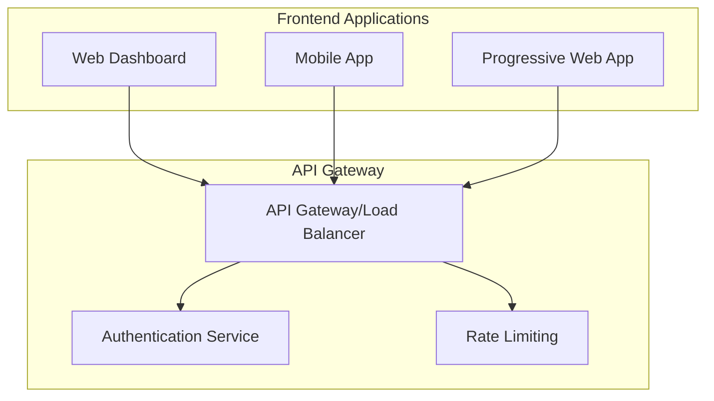
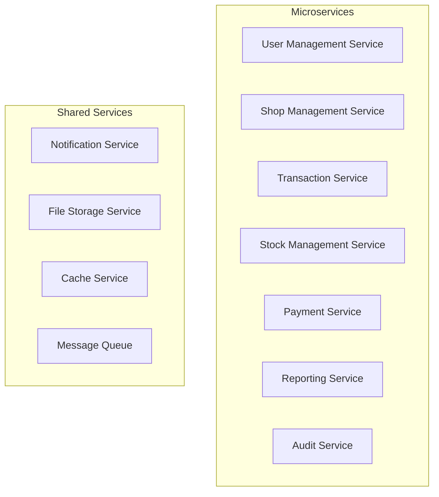
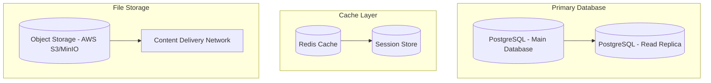
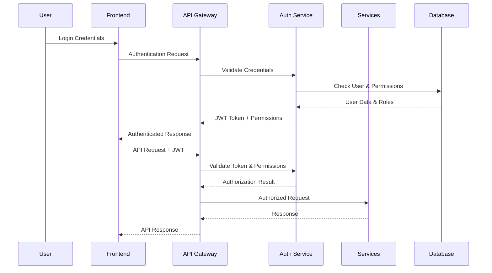

# Market Management System - System Architecture

## 🏗️ **Enterprise Architecture Overview**

This document defines the high-level system architecture, design principles, and technology stack for the Market Management System.

---

## System Design Principles

### 1. Enterprise-Ready Architecture
- **Scalability**: Designed for multi-tenant, multi-shop operations
- **Maintainability**: Clean separation of concerns with modular design
- **Security**: Role-based access control with comprehensive audit trails
- **Performance**: Optimized database design with strategic indexing

### 2. Technology Stack Recommendations

#### Backend
```
- Framework: FastAPI (Python) or Node.js/Express
- Database: PostgreSQL 14+ with JSON support
- Cache: Redis for session management and frequent queries
- Message Queue: RabbitMQ or AWS SQS for async processing
- API Documentation: OpenAPI/Swagger auto-generation
```

#### Frontend
```
- Framework: React.js with TypeScript
- State Management: Redux Toolkit or Zustand
- UI Components: Material-UI or Ant Design
- Mobile: React Native or Progressive Web App (PWA)
- Real-time: WebSockets for live updates
```

#### Infrastructure
```
- Containerization: Docker with multi-stage builds
- Orchestration: Kubernetes or Docker Compose
- CI/CD: GitHub Actions or GitLab CI
- Monitoring: Prometheus + Grafana
- Logging: ELK Stack (Elasticsearch, Logstash, Kibana)
```

---

## System Architecture Layers

### 1. Presentation Layer


### 2. Application Layer


### 3. Data Layer


---

## Security Architecture

### 1. Authentication & Authorization


### 2. Data Security Measures
- **Encryption**: AES-256 for data at rest, TLS 1.3 for data in transit
- **Access Control**: Role-based permissions with least privilege principle
- **Audit Logging**: Complete audit trail for all sensitive operations
- **Input Validation**: SQL injection prevention, XSS protection
- **API Security**: Rate limiting, CORS configuration, API versioning

---

## Performance Optimization Strategy

### 1. Database Optimization
```sql
-- Critical Performance Indexes
CREATE INDEX CONCURRENTLY idx_transaction_shop_date_status 
ON TRANSACTION(shop_id, date, status) WHERE status = 'completed';

CREATE INDEX CONCURRENTLY idx_farmer_stock_active 
ON FARMER_STOCK(shop_id, product_id, status) WHERE status = 'active';

CREATE INDEX CONCURRENTLY idx_credit_buyer_outstanding 
ON CREDIT(buyer_user_id, status) WHERE status IN ('pending', 'partial');

-- Partitioning Strategy for Large Tables
CREATE TABLE TRANSACTION_2024 PARTITION OF TRANSACTION 
FOR VALUES FROM ('2024-01-01') TO ('2025-01-01');

CREATE TABLE AUDIT_LOG_2024 PARTITION OF AUDIT_LOG 
FOR VALUES FROM ('2024-01-01') TO ('2025-01-01');
```

### 2. Caching Strategy
```
Cache Layers:
1. Application Cache (Redis) - 15 minutes TTL
   - User sessions and permissions
   - Frequently accessed product data
   - Real-time stock quantities

2. Database Query Cache - 5 minutes TTL
   - Complex reports and analytics
   - Aggregated transaction data

3. CDN Cache - 24 hours TTL
   - Static assets and images
   - API documentation
```

### 3. Query Optimization
```sql
-- Optimized Stock Query with Materialized View
CREATE MATERIALIZED VIEW mv_current_stock AS
SELECT 
    fs.shop_id,
    fs.product_id,
    fs.farmer_user_id,
    p.name as product_name,
    c.name as category_name,
    SUM(fs.quantity) as total_quantity,
    COUNT(*) as stock_entries,
    MAX(fs.date) as latest_delivery
FROM FARMER_STOCK fs
JOIN PRODUCT p ON fs.product_id = p.id
JOIN CATEGORY c ON p.category_id = c.id
WHERE fs.status = 'active'
GROUP BY fs.shop_id, fs.product_id, fs.farmer_user_id, p.name, c.name;

-- Refresh materialized view every 30 minutes
CREATE OR REPLACE FUNCTION refresh_stock_view()
RETURNS void AS $$
BEGIN
    REFRESH MATERIALIZED VIEW CONCURRENTLY mv_current_stock;
END;
$$ LANGUAGE plpgsql;
```

---

## Scalability Considerations

### 1. Horizontal Scaling
- **Database Sharding**: Partition by shop_id for multi-tenant isolation
- **Read Replicas**: Distribute read queries across multiple replicas
- **Load Balancing**: Round-robin or least-connections for API endpoints

### 2. Vertical Scaling
- **Resource Monitoring**: CPU, memory, and I/O usage tracking
- **Auto-scaling**: Kubernetes HPA based on metrics
- **Resource Allocation**: Dedicated resources for high-traffic endpoints

### 3. Data Archival Strategy
```sql
-- Archive old transactions and audit logs
CREATE TABLE TRANSACTION_ARCHIVE AS SELECT * FROM TRANSACTION WHERE FALSE;
CREATE TABLE AUDIT_LOG_ARCHIVE AS SELECT * FROM AUDIT_LOG WHERE FALSE;

-- Archive data older than 2 years
INSERT INTO TRANSACTION_ARCHIVE 
SELECT * FROM TRANSACTION 
WHERE date < NOW() - INTERVAL '2 years';

INSERT INTO AUDIT_LOG_ARCHIVE 
SELECT * FROM AUDIT_LOG 
WHERE created_at < NOW() - INTERVAL '2 years';
```

---

## Monitoring & Observability

### 1. Application Metrics
```
Business Metrics:
- Daily transaction volume and value
- Active users per shop
- Credit utilization rates
- Stock turnover rates

Technical Metrics:
- API response times (P95, P99)
- Database query performance
- Cache hit rates
- Error rates by endpoint
```

### 2. Health Checks
```json
{
  "health_checks": {
    "database": {
      "endpoint": "/health/database",
      "check_interval": "30s",
      "timeout": "5s"
    },
    "cache": {
      "endpoint": "/health/cache",
      "check_interval": "30s",
      "timeout": "3s"
    },
    "external_apis": {
      "endpoint": "/health/external",
      "check_interval": "60s",
      "timeout": "10s"
    }
  }
}
```

### 3. Alerting Strategy
```yaml
alerts:
  - name: High Error Rate
    condition: error_rate > 5%
    duration: 5m
    severity: critical
    
  - name: Slow Database Queries
    condition: query_duration_p95 > 1s
    duration: 10m
    severity: warning
    
  - name: Low Cache Hit Rate
    condition: cache_hit_rate < 80%
    duration: 15m
    severity: warning
```

---

## Deployment Architecture

### 1. Environment Strategy
```
Environments:
- Development: Individual developer environments
- Staging: Pre-production testing and integration
- Production: Live customer-facing environment

Deployment Strategy:
- Blue-Green Deployment for zero downtime
- Feature flags for gradual rollouts
- Database migrations with rollback capability
```

### 2. Container Architecture
```dockerfile
# Multi-stage build example
FROM node:18-alpine AS builder
WORKDIR /app
COPY package*.json ./
RUN npm ci --only=production

FROM node:18-alpine AS runtime
WORKDIR /app
COPY --from=builder /app/node_modules ./node_modules
COPY . .
EXPOSE 3000
CMD ["npm", "start"]
```

---

## 🎯 **Architecture Benefits**

### ✅ **Scalability Features**
- **Multi-tenant**: Isolated shop data with shared infrastructure
- **Horizontal scaling**: Microservices architecture supports independent scaling
- **Performance**: Strategic caching and database optimization
- **Monitoring**: Comprehensive observability stack

### 🔒 **Security Features**
- **Authentication**: JWT-based with role-based access control
- **Encryption**: End-to-end data protection
- **Audit**: Complete traceability for compliance
- **Validation**: Input sanitization and SQL injection prevention

### 🚀 **Development Benefits**
- **Maintainable**: Clean architecture with separation of concerns
- **Testable**: Modular design supports unit and integration testing
- **Deployable**: Containerized with CI/CD pipeline automation
- **Observable**: Comprehensive monitoring and logging

This architecture provides a solid foundation for building an enterprise-grade Market Management System that can scale with business growth while maintaining security and performance standards.
