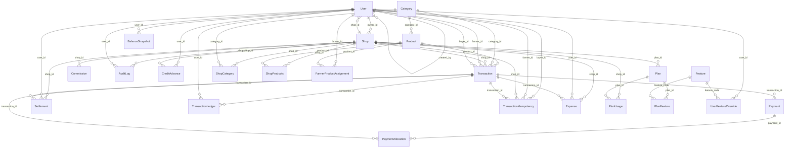

# Kisaan Center ERD (Mermaid)

Paste this diagram into https://mermaid.live or use a VS Code Mermaid extension to view it visually.


```mermaid
erDiagram
  User ||--o{ Shop : "owner_id"
  Shop ||--o{ User : "shop_id"
  User ||--o{ User : "created_by"
  Shop ||--o{ Plan : "plan_id"
  Category ||--o{ Product : "category_id"
  Product ||--o{ Transaction : "product_id"
  Category ||--o{ Transaction : "category_id"
  Shop ||--o{ Transaction : "shop_id"
  User ||--o{ Transaction : "farmer_id"
  User ||--o{ Transaction : "buyer_id"
  Transaction ||--o{ Payment : "transaction_id"
  Payment ||--o{ PaymentAllocation : "payment_id"
  Transaction ||--o{ PaymentAllocation : "transaction_id"
  Shop ||--o{ Settlement : "shop_id"
  User ||--o{ Settlement : "user_id"
  Transaction ||--o{ Settlement : "transaction_id"
  Shop ||--o{ Commission : "shop_id"
  Shop ||--o{ AuditLog : "shop_id"
  User ||--o{ AuditLog : "user_id"
  User ||--o{ BalanceSnapshot : "user_id"
  Transaction ||--o{ TransactionLedger : "transaction_id"
  User ||--o{ TransactionLedger : "user_id"
  User ||--o{ TransactionIdempotency : "buyer_id"
  User ||--o{ TransactionIdempotency : "farmer_id"
  Shop ||--o{ TransactionIdempotency : "shop_id"
  Transaction ||--o{ TransactionIdempotency : "transaction_id"
  User ||--o{ CreditAdvance : "user_id"
  Shop ||--o{ CreditAdvance : "shop_id"
  Shop ||--o{ Expense : "shop_id"
  User ||--o{ Expense : "user_id"
  Transaction ||--o{ Expense : "transaction_id"
  Shop ||--o{ PlanUsage : "shop_id"
  Plan ||--o{ PlanUsage : "plan_id"
  Plan ||--o{ PlanFeature : "plan_id"
  Feature ||--o{ PlanFeature : "feature_code"
  Shop ||--o{ ShopCategory : "shop_id"
  Category ||--o{ ShopCategory : "category_id"
  Shop ||--o{ ShopProducts : "shop_id"
  Product ||--o{ ShopProducts : "product_id"
  User ||--o{ UserFeatureOverride : "user_id"
  Feature ||--o{ UserFeatureOverride : "feature_code"
  User ||--o{ FarmerProductAssignment : "farmer_id"
  Product ||--o{ FarmerProductAssignment : "product_id"
```
```
