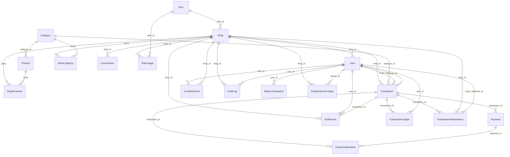

# Kisaan Center Data Model ERD (Draft)

> Status: Draft (Generated YYYY-MM-DD; update after model changes)

## Legend
```
PK  Primary Key
FK  Foreign Key (explicit association defined)
FK? Foreign Key column present but no Sequelize association wired
[!] Attention / anomaly (naming, precision, missing link, duplication)
```

## Mermaid Diagram



### SimpleFarmerLedger (simple_farmer_ledger)
- PK: id
- FK: shop_id -> kisaan_shops(id)
- FK: farmer_id -> kisaan_users(id)
- amount: DECIMAL(12,2)
- type: credit/debit (direction)
- category: sale/expense/withdrawal/other
- notes: TEXT
- created_at: timestamp
- created_by: FK to kisaan_users(id) (must be shop owner or employee; NOT farmer)

#### Access Control
- Only shop owner/employee can create, edit, or delete entries (created_by enforced)
- Farmer can only view (read-only) their own ledger entries and balance

## Table Notes
### Plan (kisaan_plans)
- PK: id
- Unique: name
- Pricing fields variant (monthly/quarterly/yearly) [!] consider normalization or pricing tier table

### Shop (kisaan_shops)
- FK: owner_id -> users (no explicit association in index.ts) [!]
- FK: plan_id -> plans

### User (kisaan_users)
- FK: shop_id -> shops
- Self FK: created_by -> users (not associated) [!]
- Monetary fields: balance DECIMAL(12,2), cumulative_value DECIMAL(18,2) [!] precision divergence

### Category (kisaan_categories)
- timestamps disabled; others enabled elsewhere [!] inconsistent lifecycle tracking

### Product (kisaan_products)
- FK: category_id -> categories
- Optional status vs record_status duplication [!]

### Transaction (kisaan_transactions)
- FK: shop_id, farmer_id, buyer_id, category_id, (product_id optional) [! product_id underused vs product_name]
- Monetary fields: total_sale_value, shop_commission, farmer_earning, commission_amount, total_amount [!] overlapping semantics
- commission_rate & commission_type duplicative of Commission table [!]

### TransactionIdempotency (kisaan_transaction_idempotency)
- Unique: key
- References buyer_id, farmer_id, shop_id, transaction_id (none associated) [!]
- Should enforce association to Transaction and optionally cascade on delete

### Payment (kisaan_payments)
- ENUM payer_type, payee_type, method, status – candidates for shared enum file

### PaymentAllocation (payment_allocations)
- Junction between Payment and Transaction; missing association wiring [!]

### TransactionLedger (kisaan_transaction_ledger)
- No associations; track balance delta per user per transaction [!] add belongsTo(User,Transaction)

### BalanceSnapshot (balance_snapshots)
- Historical snapshot; add belongsTo(User) for eager loading [!]

### CreditAdvance (kisaan_credits)
- No timestamps (timestamps: false) but columns created_at/updated_at present [!] unify

### Settlement (kisaan_settlements)
- Links shop, user, transaction

### Commission (kisaan_commissions)
- Tied to shop; may evolve with product/category dimension later

### AuditLog (kisaan_audit_logs)
- ENUM fields; no updated_at (immutable log) – acceptable

### PlanUsage (plan_validation / planUsage alias)
- Tracks usage quotas; naming mismatch between file (`planValidation.ts`) exporting PlanUsage [!] rename for clarity

## Cross-Cutting Inconsistencies
| Aspect | Observed Variants | Recommendation |
| ------ | ----------------- | -------------- |
| Timestamp columns | created_at/updated_at (snake) vs disabled vs camel in interfaces | Standardize: always timestamps: true with createdAt/updatedAt mapped to snake columns |
| Monetary precision | DECIMAL(10,2),(12,2),(18,2) | Adopt tier: (18,2) for cumulative aggregates, (12,2) for transactional amounts, document rule |
| Status representation | ENUMs inline per model | Centralize constants (e.g. src/domain/enums.ts) |
| Commission data | Commission table + duplicated fields in Transaction | Store derived fields (commission_amount) only; persist commission_rate/type source-of-truth in Commission or override on User |
| Product link in Transaction | product_name + optional product_id | Enforce product_id FK; keep name as denormalized snapshot (non-null) |
| Unassociated FKs | owner_id, created_by, product_id optional, idempotency foreign refs | Add explicit belongsTo for all FKs for consistency |
| Validation layering | Mixed inline numeric constraints only | Add schema validation (Zod) layer for create/update DTOs |

## Associations Added in Code
```
All previously proposed missing associations have been implemented in `models/index.ts`:
```
User.belongsTo(User, { foreignKey: 'created_by', as: 'creator' })
Shop.belongsTo(User, { foreignKey: 'owner_id', as: 'owner' })
PaymentAllocation.belongsTo(Payment, { foreignKey: 'payment_id', as: 'payment' })
PaymentAllocation.belongsTo(Transaction, { foreignKey: 'transaction_id', as: 'transactionAllocation' })
TransactionIdempotency.belongsTo(Transaction, { foreignKey: 'transaction_id', as: 'transaction' })
TransactionIdempotency.belongsTo(Shop, { foreignKey: 'shop_id', as: 'idempotencyShop' })
TransactionIdempotency.belongsTo(User, { foreignKey: 'buyer_id', as: 'idempotencyBuyer' })
TransactionIdempotency.belongsTo(User, { foreignKey: 'farmer_id', as: 'idempotencyFarmer' })
TransactionLedger.belongsTo(Transaction, { foreignKey: 'transaction_id', as: 'transaction' })
TransactionLedger.belongsTo(User, { foreignKey: 'user_id', as: 'ledgerUser' })
BalanceSnapshot.belongsTo(User, { foreignKey: 'user_id', as: 'snapshotUser' })
```
PlanUsage.belongsTo(Plan, ...) already present (verify naming alignment)
```

## Next Steps
1. Confirm ERD structure & association additions you want implemented now.
2. Implement associations & regenerate diagram.
3. Proceed to endpoint→table mapping matrix.

> Please review and say "approve ERD" or provide adjustments.
